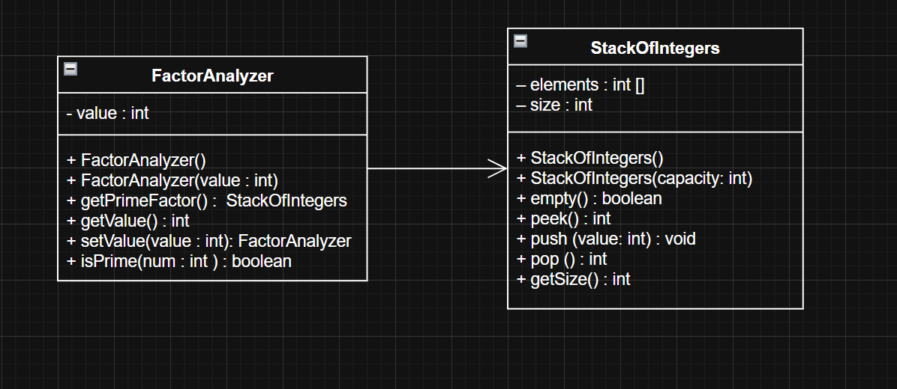

# Factor Analyzer Program

## Problem Statement

**Display the prime factors**  
Write a program that prompts the user to enter a positive integer and displays all its smallest factors in decreasing order. For example, if the integer is 120, the smallest factors are displayed as 5, 3, 2, 2, 2.  
Use the `StackOfIntegers` class to store the factors (e.g., 2, 2, 2, 3, 5) and retrieve and display them in reverse order.

## UML Diagram

### Author

This code was written by **Abdulrahman Khaled Farhan**  
Date: April 23, 2025
