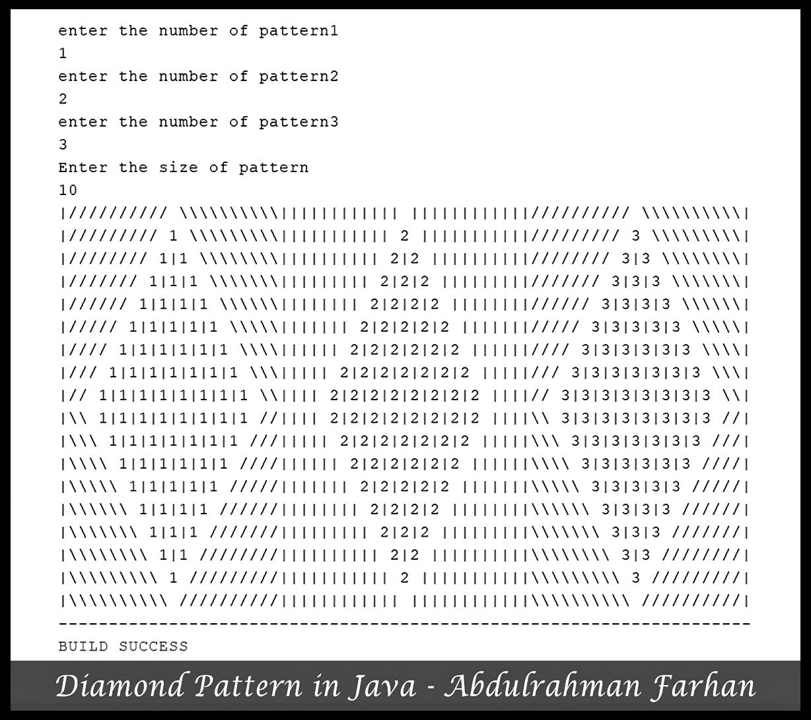

## Image of the Pattern

Below is an example image representing the output pattern:

## How the Program Works
1. **`main` method**: Takes user input and calls other methods to print the upper and lower halves of the diamond.
2. **`printUpperHalf` method**: Prints the upper half of the diamond using the different patterns.
3. **`printLowerHalf` method**: Prints the lower half of the diamond using the different patterns.
4. **`printLine` method**: Responsible for printing a single line of the pattern, taking into account the number of spaces and pattern width.

## License
Developed by **Abdulrahman Farhan**.

--------------------------------------------------------
# Diamond Pattern

This program prints a diamond-shaped pattern on the screen based on user input. It uses different characters to create a visual representation of a diamond shape.

## Description
The program asks the user to input:
1. **Pattern 1 count**: The number of times the first pattern will appear in the upper and lower halves of the diamond.
2. **Pattern 2 count**: The number of times the second pattern will appear in the upper and lower halves of the diamond.
3. **Pattern 3 count**: The number of times the third pattern will appear in the upper and lower halves of the diamond.
4. **Pattern size**: The size of the diamond pattern.

The program prints the diamond shape with various characters such as `|`, `/`, and `\` to form the pattern.

## Requirements
- **Java 8 or higher**.

## How to Use
1. Run the program.
2. Enter the following values when prompted:
   - **Pattern 1 count** (e.g., 1).
   - **Pattern 2 count** (e.g., 2).
   - **Pattern 3 count** (e.g., 3).
   - **Pattern size** (e.g., 10).
3. The diamond pattern will be printed on the screen.
